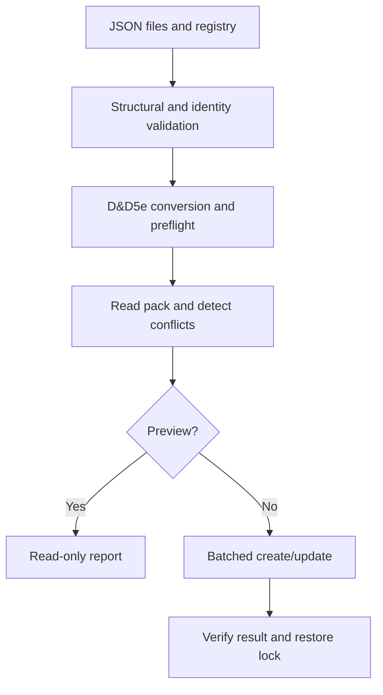

# Architecture and API

## Decisions

1. **Repository first.** Source JSON and implementation live here. No generated Foundry database
   is a source file. The initial repository contained only the README heading.
2. **Registry-driven data.** `data/catalogue.json` lists files and controlled vocabularies.
   Split content into more files when useful; a content file is not itself a shop identity.
3. **Two kinds of identity.** Human-readable permanent IDs are preserved in
   `flags.devils-table.sourceId`. Foundry requires short document IDs; a frozen FNV-1a 64-bit
   mapping of the entire permanent ID produces 16 hexadecimal characters. Collisions are checked
   across active and reserved IDs and abort validation. The algorithm is not a cryptographic hash.
4. **Shared validation.** Browser and Node use the same JSON Schemas and validator. The small
   supported schema vocabulary is deliberately explicit. Unsupported keywords throw rather than
   silently loosening validation. This is not advertised as a general JSON Schema implementation.
5. **Explicit system boundary.** The converter supports ordinary goods (`loot`), native `container`
   Items and mundane `consumable` Items with explicit utility activities.
   The adapter preflights with the installed D&D5e document models, and guards the exact target
   version. Source rules are explicitly `2014`, even in a world configured for modern rules.
6. **One generated Item pack.** An item with multiple shop tags stays one Item. Generated data
   lives in `world.devils-table-items`, not in installed module files or separate shop copies.
7. **Non-deleting reconciliation.** Validate, convert, preflight, read and plan before unlocking.
   Conflicts abort early. Missing documents are created with stable IDs; changed generated fields
   are updated. Unchanged entries are skipped. Retired/unrelated documents are preserved.
8. **No false transaction promise.** Each write is a bounded Foundry batch; the whole build is not
   atomic. A partial failure is reported and a rerun converges. Locks are restored in `finally`.
   Only the active GM can operate, and the shared service rejects concurrent calls in one client.
   Multiple tabs with the same GM are not coordinated: use one tab.
9. **Separation of data and mechanics.** Shops, category and availability are metadata, not
   automatic stock, attacks, healing or spell effects. Adjusted weights are stored exactly,
   not recalculated by guessed multipliers. The module never changes world encumbrance settings.
10. **Release discipline.** Versioned source, changelog, checks, runtime-only ZIP and acceptance
    checklist precede a public release. License selection and remote release publication are not
    silently performed by this framework.
11. **Builder-only shop context.** Structured Merchant Notes and category plans live in their own
    JSON files with shared schemas. The Item converter receives only canonical item records.
    Shop/category filters select entries after validating the entire catalogue; out-of-scope
    documents remain untouched. Planned names never substitute for missing item records.
12. **Honest container weights.** Empty mass is copied exactly; contents contribute their normal
    weight. Native capacities use pounds and cubic feet, with a small explicit US liquid-volume
    conversion. Volume limits, locks and liquid consumption are not newly automated mechanics.
13. **Saved description equivalence.** Foundry sanitizes HTML on the server, beyond client model
    validation. Compare only equivalent quote entities and break-tag spellings in description
    fields; do not strip HTML or relax other generated fields. Remaining differences produce
    bounded source-ID/field diagnostics using the same comparison rules as preview and rebuild.
14. **One purchase, one quantity.** Optional `saleUnit` text is retained in module flags. Prices,
    weight and any consumption apply to the whole authored purchase, including listed packaging
    or kit parts. No nested component generation or automatic bundle splitting is introduced.
15. **Small consumable boundary.** `consumable-factory.js` maps only `food` and `trinket` with
    explicit consume/reusable modes. It derives a stable embedded activity ID from the item ID
    plus `_USE`; these IDs are scoped within each Item. Blank `itemUses` targets refer to the
    owning Item after actor import. Consume uses native one-use/auto-destroy semantics; reusable
    goods have no consumption. Light metadata remains reference data; duration is informational.
    Neither the builder nor a startup hook changes token lights, transfers fuel or schedules use.

## Build sequence



## Public API

After `init`, obtain the API with `game.modules.get("devils-table").api`.

```js
const api = game.modules.get("devils-table").api;
api.openBuilder();                                      // GM UI
const catalogue = await api.loadCatalogue();            // no writes
const validation = api.validateCatalogue(catalogue);     // no writes
const preview = await api.rebuildCompendiums();          // dryRun defaults to true
const containers = await api.rebuildCompendiums({
  shopId: "general-store", categoryId: "containers"      // filtered preview
});
// Only after reviewing the preview and backing up the world:
const result = await api.rebuildCompendiums({ dryRun: false });
```

`loadCatalogue` returns the registry, item/catalogue/shop/category schemas, ledger,
`shopDefinitions`, `categoryDefinitions` and `{item, location}` entries.
`validateCatalogue` returns `{valid, count, errors, warnings}`; errors contain a `path` and `message`.
`rebuildCompendiums` returns a report with planned `create`/`update`, `unchanged`, `preserved`,
`written`, target pack, selected `scope`, status, time and warnings. It throws on failure. Validation errors carry
an additional `details` array. `onProgress(message)` is optional and does not control persistence.
Read-back failures also carry `details` with source IDs, field paths and shortened expected/saved
values. These details are kept in the last-build summary even if lock cleanup also fails.

Omitting `shopId`/`categoryId` (or using `null`) includes all authored entries. Unknown filters fail
before writes. Filtered builds preserve Items outside the selection; shared shop tags never create
additional copies. All source data is validated even when only one category will be built.

The UI asks for confirmation. Direct API callers intentionally opt into writes with `dryRun: false`.
The API is framework-versioned but not yet a stable public integration contract.

## Checked primary references

- [Foundry module manifests](https://foundryvtt.com/article/module-development/)
- [V14 ApplicationV2](https://foundryvtt.com/api/v14/classes/foundry.applications.api.ApplicationV2.html)
- [V14 compendium API](https://foundryvtt.com/api/v14/classes/foundry.documents.collections.CompendiumCollection.html)
- [V14 settings](https://foundryvtt.com/api/v14/classes/foundry.helpers.ClientSettings.html)
- [V14 HTMLField server sanitization](https://foundryvtt.com/api/v14/classes/foundry.data.fields.HTMLField.html)
- [D&D5e 5.3.3 physical item fields](https://github.com/foundryvtt/dnd5e/blob/release-5.3.3/module/data/item/templates/physical-item.mjs)
- [D&D5e 5.3.3 source fields](https://github.com/foundryvtt/dnd5e/blob/release-5.3.3/module/data/shared/source-field.mjs)
- [D&D5e 5.3.3 loot model](https://github.com/foundryvtt/dnd5e/blob/release-5.3.3/module/data/item/loot.mjs)
- [D&D5e 5.3.3 container model](https://github.com/foundryvtt/dnd5e/blob/release-5.3.3/module/data/item/container.mjs)
- [D&D5e 5.3.3 supported units](https://github.com/foundryvtt/dnd5e/blob/release-5.3.3/module/config.mjs)
- [D&D5e 5.3.3 consumable model](https://github.com/foundryvtt/dnd5e/blob/release-5.3.3/module/data/item/consumable.mjs)
- [D&D5e 5.3.3 utility activity](https://github.com/foundryvtt/dnd5e/blob/release-5.3.3/module/data/activity/utility-data.mjs)
- [D&D5e 5.3.3 owning-item consumption](https://github.com/foundryvtt/dnd5e/blob/release-5.3.3/module/data/activity/fields/consumption-targets-field.mjs)
- [D&D5e 5.3.3 limited-use fields](https://github.com/foundryvtt/dnd5e/blob/release-5.3.3/module/data/shared/uses-field.mjs)

Documentation/source review is not a substitute for executing the module in the target environment.
