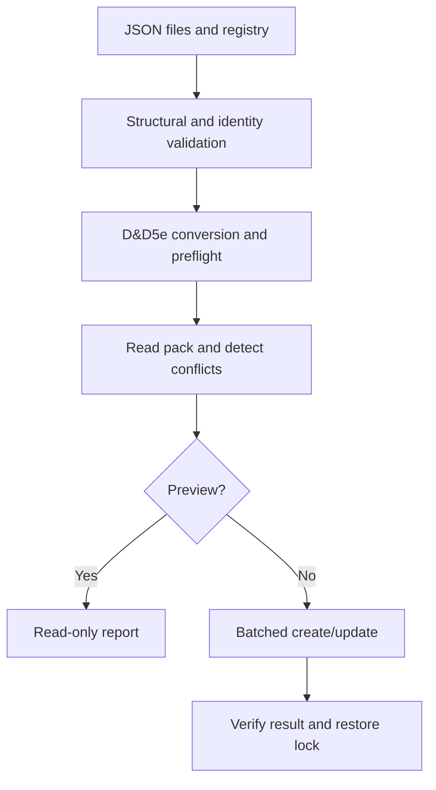

# Architecture and API

## Decisions

1. **Repository first.** Source JSON and implementation live here. No generated Foundry database
   is a source file. The initial repository contained only the README heading.
2. **Registry-driven data.** `data/catalogue.json` lists files and controlled vocabularies.
   Split content into more files when useful; a content file is not itself a shop identity.
3. **Two kinds of identity.** Human-readable permanent IDs are preserved in
   `flags.devils-table.sourceId`. Foundry requires short document IDs; a frozen FNV-1a 64-bit
   mapping of the entire permanent ID produces 16 hexadecimal characters. Collisions are checked
   across active and reserved IDs and abort validation. The algorithm is not a cryptographic hash.
4. **Shared validation.** Browser and Node use the same JSON Schemas and validator. The small
   supported schema vocabulary is deliberately explicit. Unsupported keywords throw rather than
   silently loosening validation. This is not advertised as a general JSON Schema implementation.
5. **Explicit system boundary.** The converter supports only ordinary goods (`loot`) now.
   The adapter preflights with the installed D&D5e document models, and guards the exact target
   version. Source rules are explicitly `2014`, even in a world configured for modern rules.
6. **One generated Item pack.** An item with multiple shop tags stays one Item. Generated data
   lives in `world.devils-table-items`, not in installed module files or separate shop copies.
7. **Non-deleting reconciliation.** Validate, convert, preflight, read and plan before unlocking.
   Conflicts abort early. Missing documents are created with stable IDs; changed generated fields
   are updated. Unchanged entries are skipped. Retired/unrelated documents are preserved.
8. **No false transaction promise.** Each write is a bounded Foundry batch; the whole build is not
   atomic. A partial failure is reported and a rerun converges. Locks are restored in `finally`.
   Only the active GM can operate, and the shared service rejects concurrent calls in one client.
   Multiple tabs with the same GM are not coordinated: use one tab.
9. **Separation of data and mechanics.** Shops, category and availability are metadata, not
   automatic stock, attacks, healing or spell effects. Adjusted weights are stored exactly,
   not recalculated by guessed multipliers. The module never changes world encumbrance settings.
10. **Release discipline.** Versioned source, changelog, checks, runtime-only ZIP and acceptance
    checklist precede a public release. License selection and remote release publication are not
    silently performed by this framework.

## Build sequence



## Public API

After `init`, obtain the API with `game.modules.get("devils-table").api`.

```js
const api = game.modules.get("devils-table").api;
api.openBuilder();                                      // GM UI
const catalogue = await api.loadCatalogue();            // no writes
const validation = api.validateCatalogue(catalogue);     // no writes
const preview = await api.rebuildCompendiums();          // dryRun defaults to true
// Only after reviewing the preview and backing up the world:
const result = await api.rebuildCompendiums({ dryRun: false });
```

`loadCatalogue` returns the registry, schemas, ledger and `{item, location}` entries.
`validateCatalogue` returns `{valid, count, errors, warnings}`; errors contain a `path` and `message`.
`rebuildCompendiums` returns a report with planned `create`/`update`, `unchanged`, `preserved`,
`written`, target pack, status, time and warnings. It throws on failure. Validation errors carry
an additional `details` array. `onProgress(message)` is optional and does not control persistence.

The UI asks for confirmation. Direct API callers intentionally opt into writes with `dryRun: false`.
The API is framework-versioned but not yet a stable public integration contract.

## Checked primary references

- [Foundry module manifests](https://foundryvtt.com/article/module-development/)
- [V14 ApplicationV2](https://foundryvtt.com/api/v14/classes/foundry.applications.api.ApplicationV2.html)
- [V14 compendium API](https://foundryvtt.com/api/v14/classes/foundry.documents.collections.CompendiumCollection.html)
- [V14 settings](https://foundryvtt.com/api/v14/classes/foundry.helpers.ClientSettings.html)
- [D&D5e 5.3.3 physical item fields](https://github.com/foundryvtt/dnd5e/blob/release-5.3.3/module/data/item/templates/physical-item.mjs)
- [D&D5e 5.3.3 source fields](https://github.com/foundryvtt/dnd5e/blob/release-5.3.3/module/data/shared/source-field.mjs)
- [D&D5e 5.3.3 loot model](https://github.com/foundryvtt/dnd5e/blob/release-5.3.3/module/data/item/loot.mjs)

Documentation/source review is not a substitute for executing the module in the target environment.
