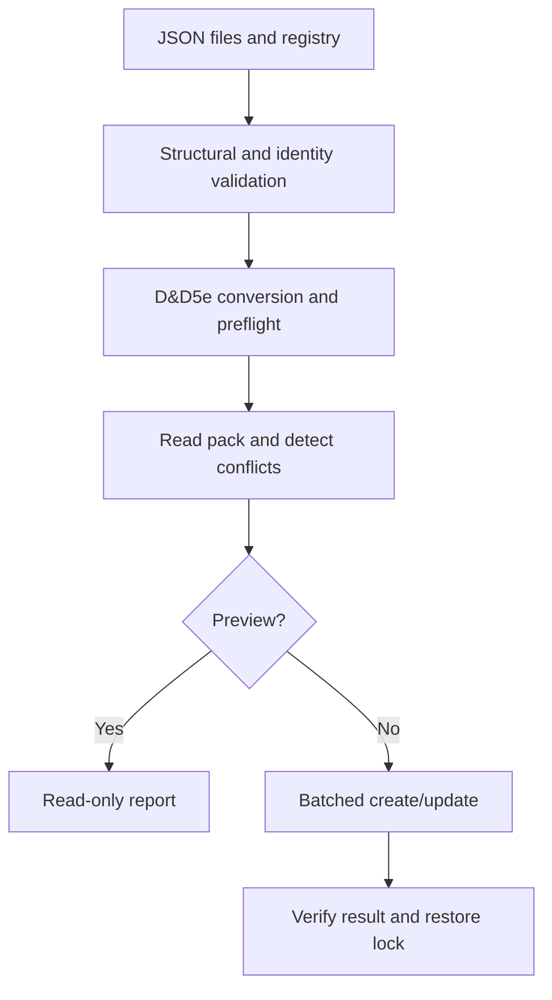

# Architecture and API

## Decisions

1. **Repository first.** Source JSON and implementation live here. No generated Foundry database
   is a source file. The initial repository contained only the README heading.
2. **Registry-driven data.** `data/catalogue.json` lists files and controlled vocabularies.
   Split content into more files when useful; a content file is not itself a shop identity.
3. **Two kinds of identity.** Human-readable permanent IDs are preserved in
   `flags.devils-table.sourceId`. Foundry requires short document IDs; a frozen FNV-1a 64-bit
   mapping of the entire permanent ID produces 16 hexadecimal characters. Collisions are checked
   across active and reserved IDs and abort validation. The algorithm is not a cryptographic hash.
4. **Shared validation.** Browser and Node use the same JSON Schemas and validator. The small
   supported schema vocabulary is deliberately explicit. Unsupported keywords throw rather than
   silently loosening validation. This is not advertised as a general JSON Schema implementation.
5. **Explicit system boundary.** The converter supports ordinary goods (`loot`), native `container`
   Items and mundane `consumable` Items with explicit utility activities.
   The adapter preflights with the installed D&D5e document models, and guards the exact target
   version. Source rules are explicitly `2014`, even in a world configured for modern rules.
6. **One generated Item pack.** An item with multiple shop tags stays one Item. Generated data
   lives in `world.devils-table-items`, not in installed module files or separate shop copies.
7. **Non-deleting reconciliation.** Validate, convert, preflight, read and plan before unlocking.
   Conflicts abort early. Missing documents are created with stable IDs; changed generated fields
   are updated. Unchanged entries are skipped. Retired/unrelated documents are preserved.
8. **No false transaction promise.** Each write is a bounded Foundry batch; the whole build is not
   atomic. A partial failure is reported and a rerun converges. Locks are restored in `finally`.
   Only the active GM can operate, and the shared service rejects concurrent calls in one client.
   Multiple tabs with the same GM are not coordinated: use one tab.
9. **Separation of data and mechanics.** Shops, category and availability guide explicit stock
   generation; they do not add attacks, healing or spell effects. Adjusted weights are stored exactly,
   not recalculated by guessed multipliers. The module never changes world encumbrance settings.
10. **Release discipline.** Versioned source, changelog, checks, runtime-only ZIP and acceptance
    checklist precede a public release. License selection and remote release publication are not
    silently performed by this framework.
11. **Builder-only shop context.** Structured Merchant Notes and category plans live in their own
    JSON files with shared schemas. The Item converter receives only canonical item records.
    Shop/category filters select entries after validating the entire catalogue; out-of-scope
    documents remain untouched. Planned names never substitute for missing item records.
12. **Honest container weights.** Empty mass is copied exactly; contents contribute their normal
    weight. Native capacities use pounds and cubic feet, with a small explicit US liquid-volume
    conversion. Volume limits, locks and liquid consumption are not newly automated mechanics.
13. **Saved description equivalence.** Foundry sanitizes HTML on the server, beyond client model
    validation. Compare only equivalent quote entities and break-tag spellings in description
    fields; do not strip HTML or relax other generated fields. Remaining differences produce
    bounded source-ID/field diagnostics using the same comparison rules as preview and rebuild.
14. **One purchase, one quantity.** Optional `saleUnit` text is retained in module flags. Prices,
    weight and any consumption apply to the whole authored purchase, including listed packaging
    or kit parts. No nested component generation or automatic bundle splitting is introduced.
15. **Small consumable boundary.** `consumable-factory.js` maps only `food` and `trinket` with
    explicit consume/reusable modes. It derives a stable embedded activity ID from the item ID
    plus `_USE`; these IDs are scoped within each Item. Blank `itemUses` targets refer to the
    owning Item after actor import. Consume uses native one-use/auto-destroy semantics; reusable
    goods have no consumption. Light metadata remains reference data; duration is informational.
    Neither the builder nor a startup hook changes token lights, transfers fuel or schedules use.
16. **Separate stock generation.** A dedicated GM settings menu calls a separate builder service
    targeting `world.devils-table-stock-tables`. Stock profiles and a table-ID ledger extend the
    catalogue loader without changing Item output. The existing build lifecycle accepts optional
    preparation, planning, adapter and verification functions; the Item defaults are retained.
17. **Native V14 table documents.** Results use string `document`/`text` types and the current
    `name`, `description` and `documentUuid` fields. Item results reference the single world Item
    pack. Rotating results reference generated Often/Rarely tables. Native document validation
    and referenced-Item identity checks happen before any pack is created or unlocked.
18. **Owned embedded rows.** A table ID derives from its permanent profile prefix, category and
    tier; each result ID derives from its table ID and item/tier key. Reconciliation ignores row
    storage order, creates/updates required rows and removes only obsolete owned rows using
    explicit `TableResult` embedded-document APIs in bounded batches. Unmanaged rows block the
    selected build. Whole tables, Items, folders and foreign flags are preserved. A partial row
    update is retryable under the same read-back/lock contract as an Item build.
19. **Guaranteed essentials and bounded randomness.** Always tables use intentional overlapping
    1–1 ranges to return every core good. Rotating d100 ranges apply the source probabilities;
    empty tiers produce no extra stock. The read-only stock action verifies current built tables,
    includes all Always results, then samples eligible Often/Rarely pools without replacement.
    It does not retry empty tiers into another tier or promote rare goods when Often is exhausted.
    Draw counts are bounded. Stock persistence, merchant actors and purchasing await separate
    requirements. Table build and cleanup share a client guard; use one operation/tab.
20. **Compact table set.** Generate four tables per shop, preserving the original whole-shop UUIDs.
    Filter category-eligible item IDs before sampling these shared pools. Category draw defaults
    still apply, and an empty filtered tier never borrows items from another category or tier.
21. **Weighted quantities after presence.** Canonical quantity profiles and a complete tier/price
    matrix select one d100 distribution per chosen good. Validation bounds outcomes and enforces
    lower expected stock for increasing price/scarcity. Return quantity, profile and die result with
    each sale unit; keep compendium Items, actor inventories and selection probabilities unchanged.
22. **Explicit legacy cleanup.** A separate service previews exact, reserved superseded category
    tables and accepts only the reviewed IDs. Edited data, folders, foreign flags and known incoming
    references from this pack/world RollTables prevent deletion; dependency protection propagates.
    Check other references manually. Current whole-shop tables are required, writes are bounded,
    IDs stay reserved, lock restoration is attempted and read-back/cleanup records expose failure.

## Build sequence



## Public API

After `init`, obtain the API with `game.modules.get("devils-table").api`.

```js
const api = game.modules.get("devils-table").api;
api.openBuilder();                                      // GM UI
const catalogue = await api.loadCatalogue();            // no writes
const validation = api.validateCatalogue(catalogue);     // no writes
const preview = await api.rebuildCompendiums();          // dryRun defaults to true
const containers = await api.rebuildCompendiums({
  shopId: "general-store", categoryId: "containers"      // filtered preview
});
// Only after reviewing the preview and backing up the world:
const result = await api.rebuildCompendiums({ dryRun: false });

api.openStockBuilder();                                 // separate GM settings window
const tables = await api.rebuildStockTables();           // all shops, read-only preview
const built = await api.rebuildStockTables({ dryRun: false });
const stock = await api.rollStock({ shopId: "general-store" }); // read-only stock list
const camping = await api.rollStock({
  shopId: "general-store", categoryId: "camping", draws: 3
});
const cleanup = await api.cleanupLegacyStockTables();    // read-only removal/protection report
// After reviewing this exact list, other saved references and a world backup:
await api.cleanupLegacyStockTables({
  dryRun: false, approvedIds: cleanup.removable.map(table => table.id)
});
```

`loadCatalogue` returns the registry, item/catalogue/shop/category schemas, ledger,
`shopDefinitions`, `categoryDefinitions` and `{item, location}` entries.
`validateCatalogue` returns `{valid, count, errors, warnings}`; errors contain a `path` and `message`.
`rebuildCompendiums` returns a report with planned `create`/`update`, `unchanged`, `preserved`,
`written`, target pack, selected `scope`, status, time and warnings. It throws on failure. Validation errors carry
an additional `details` array. `onProgress(message)` is optional and does not control persistence.
Read-back failures also carry `details` with source IDs, field paths and shortened expected/saved
values. These details are kept in the last-build summary even if lock cleanup also fails.

Omitting `shopId`/`categoryId` (or using `null`) includes all authored entries. Unknown filters fail
before writes. Filtered builds preserve Items outside the selection; shared shop tags never create
additional copies. All source data is validated even when only one category will be built.

`rebuildStockTables` accepts the same filters, `dryRun` and progress callback and returns the same
report shape for its separate pack. It always generates whole-shop sets; a category selection
does not change table output. Its preflight requires referenced Items to have
already been built. Stock profile validation supplements full catalogue validation.

`rollStock` requires one shop (General Store by default) and current built tables. It returns
`{shopId, categoryId, draws, outcomes, items}`; item entries include permanent `id`, `name`,
compendium `uuid`, `tier`, `price`, `saleUnit`, `quantity`, `quantityProfile` and `quantityRoll`.
`draws` optionally overrides the whole-shop or category profile default
with an integer from 0 to 50. It uses Foundry dice and actual built ranges, with no chat, drawn-state,
pack, setting, actor or inventory writes. See [the stock guide](STOCK_TABLES.md) for native draws.

`cleanupLegacyStockTables` accepts the shop/category filters, `dryRun` (default true) and explicit
`approvedIds` for writes. It returns `removable`, `preserved` reasons, `deleted`, warnings and scope.
It never creates a pack or modifies Items. A changed removal list requires a fresh preview.

The UI asks for confirmation. Direct API callers intentionally opt into writes with `dryRun: false`.
The API is framework-versioned but not yet a stable public integration contract.

## Checked primary references

- [Foundry module manifests](https://foundryvtt.com/article/module-development/)
- [V14 ApplicationV2](https://foundryvtt.com/api/v14/classes/foundry.applications.api.ApplicationV2.html)
- [V14 compendium API](https://foundryvtt.com/api/v14/classes/foundry.documents.collections.CompendiumCollection.html)
- [V14 settings](https://foundryvtt.com/api/v14/classes/foundry.helpers.ClientSettings.html)
- [V14 HTMLField server sanitization](https://foundryvtt.com/api/v14/classes/foundry.data.fields.HTMLField.html)
- [Foundry RollTables, nested results and overlapping ranges](https://foundryvtt.com/article/roll-tables/)
- [V14 RollTable document](https://foundryvtt.com/api/v14/classes/foundry.documents.RollTable.html)
- [V14 TableResult schema](https://foundryvtt.com/api/v14/classes/foundry.documents.TableResult.html)
- [V14 result types](https://foundryvtt.com/api/v14/variables/CONST.TABLE_RESULT_TYPES.html)
- [D&D5e 5.3.3 physical item fields](https://github.com/foundryvtt/dnd5e/blob/release-5.3.3/module/data/item/templates/physical-item.mjs)
- [D&D5e 5.3.3 source fields](https://github.com/foundryvtt/dnd5e/blob/release-5.3.3/module/data/shared/source-field.mjs)
- [D&D5e 5.3.3 loot model](https://github.com/foundryvtt/dnd5e/blob/release-5.3.3/module/data/item/loot.mjs)
- [D&D5e 5.3.3 container model](https://github.com/foundryvtt/dnd5e/blob/release-5.3.3/module/data/item/container.mjs)
- [D&D5e 5.3.3 supported units](https://github.com/foundryvtt/dnd5e/blob/release-5.3.3/module/config.mjs)
- [D&D5e 5.3.3 consumable model](https://github.com/foundryvtt/dnd5e/blob/release-5.3.3/module/data/item/consumable.mjs)
- [D&D5e 5.3.3 utility activity](https://github.com/foundryvtt/dnd5e/blob/release-5.3.3/module/data/activity/utility-data.mjs)
- [D&D5e 5.3.3 owning-item consumption](https://github.com/foundryvtt/dnd5e/blob/release-5.3.3/module/data/activity/fields/consumption-targets-field.mjs)
- [D&D5e 5.3.3 limited-use fields](https://github.com/foundryvtt/dnd5e/blob/release-5.3.3/module/data/shared/uses-field.mjs)

Documentation/source review is not a substitute for executing the module in the target environment.
