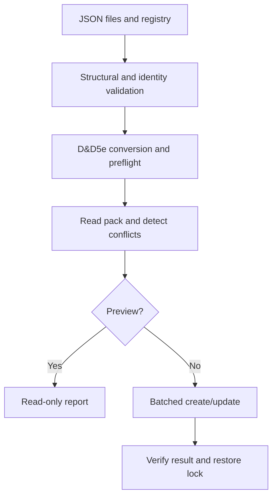

# Architecture and API

## Alchemist mapping

Alchemist JSON extends the existing shared catalogue, services, stock variants, economy profiles and merchant templates. Consumable factory mapping supports single-dose potions; optional validated healing dice generate a native heal activity with a creature target. No ingredient inventory or service Item copies are introduced. See [Alchemist Guide](ALCHEMIST_GUIDE.md).


## Sprint 14 — Daily merchant workflow (alpha.23)

Right-click a world NPC in the Actors sidebar. **Convert to Merchant** enables merchant flags and opens Setup; **Open Merchant Builder** appears for enabled merchants and opens their existing configuration. The sheet header menu and Devil's Table tab use the same terminology. Player characters, compendium entries, unlinked synthetic Actors and player users are excluded.

Conversion preserves native inventory, currency, biography, portrait, ownership and token configuration. Existing merchant notes, relationships and history are retained when re-enabling. New merchants start Closed until configured; previously configured availability is retained. The existing active-GM administration guard protects conversion during a pending checkout or recovery. Opening an enabled merchant is read-only and available to GMs.

All Builder entry points share a launcher, including the Shop UI and public API. The NPC tab offers **View Statistics**, which opens the existing Manage tab directly. Existing merchant badges remain the visual indicator. Summary and statistics stay in the existing Builder rather than adding a blocking preview window. Stock generation and Empty Stock remain in the Builder with their existing previews and confirmation; the directory never modifies inventory or money.

Live check: right-click an ordinary NPC, convert it, verify its currency and inventory are unchanged, then reopen the menu and confirm only Open Merchant Builder is visible. Check the sheet menu, Statistics shortcut and GM-only visibility. Automated checks cover conversion preservation, dynamic menu conditions and callbacks; live Foundry rendering remains a GM verification.


## Sprint 13A — Builder workflow (alpha.21)

Choose **Merchant Type** for the business catalogue and **Settlement** independently. Native dropdowns keep the forms compact as new merchant types are registered. **All Merchant Types** and **All Settlements** select all available definitions without a scrolling list of checkboxes.

The RollTable Builder filters existing stock profiles using `data/economy.json` settlement assignments; profiles without an explicit assignment use the economy default. A settlement with no authored profile shows an empty selection rather than silently building another settlement. **Advanced filters** contains the optional stock-profile refinement and **Legacy Category**, with an explanatory tooltip. Legacy Category limits stock suggestions and legacy cleanup, not modern shared table generation. Preview, build and cleanup use the same profile scope. Existing table IDs and links remain unchanged.

The Compendium Builder uses the same Merchant Type / Settlement layout. Settlement is informational there: canonical products are shared across settlements, so Item builds never duplicate or omit products based on settlement. Services are reference counts and are not Item documents. Build Preview updates with selections and shows type, settlement, categories, products, services and table count. Its build-time range is an explicitly rough planning estimate (0.1 seconds per product or 0.25 per table, with a broad upper margin), not a measured performance promise.

The individual Merchant Builder and NPC configuration use **Merchant Type** too. An NPC still needs one concrete settlement; All Settlements belongs to batch content tools only. Templates may retain descriptive names such as Village Smith, while Merchant Type and Settlement remain independently editable. The existing configuration grid and isolated filter helper can accommodate future filters without encoding them into names; no region, climate or culture mechanics are introduced.


## Generic service targets and native equipment

Item-required services define validated selectors in requirements.item. The Shop keeps temporary target IDs locally; the active GM resolves them against the purchasing Actor at quotation/approval and settlement. No target inventory is copied or consumed. Receipts retain historical target names and IDs; optional execution jobs receive those references. Item-required services are limited to one target per service per checkout.

Canonical equipment JSON uses mechanics.native for a constrained set of D&D5e equipment fields. Conversion clones these fields into native weapon, equipment, tool or ammunition Items. Source price, weight, identity and descriptions remain explicitly owned by canonical fields. Strict system document validation precedes live compendium writes. See [Blacksmith Guide](BLACKSMITH_GUIDE.md).


## Optional Integration Framework (Sprint 10C)

`integrations/manager.js` is the sole external-module gateway. Adapters encapsulate feature detection and foreign APIs; no manifest hard dependencies are introduced. The active GM serializes external operations across merchants. Services compile data-defined actions; mandatory native settlement/receipt stages remain separate and execute once. Optional jobs record attempts before effects and never replay automatically.

Private booking JournalEntries retain rental access leases and partial key/calendar references independently of receipt retention. Unique door grants allow expiry without removing pre-existing keys; native world time drives expiry and Calendaria supplies optional calendar presentation. Booking records are not inventory, currency or room-capacity stores. Room capability is data-defined, and non-Tavern providers use the same UI.

See [integration configuration and constraints](INTEGRATIONS.md) and [developer contract](INTEGRATION_DEVELOPERS.md) for schemas, registration, source review and recovery.

## Native identity and business metadata (Sprint 11A)

If Foundry or D&D5e already stores a value, reference it rather than duplicating it. `merchant/identity.js` is the native identity adapter and merchant-only payload validator. System Tags are transient read-only descriptors; Merchant Tags are private editable business metadata. Native document hooks repaint read-only Builder fields without replacing draft inputs. Public socket presentation explicitly projects only approved business text, portrait and availability. Historical receipts and recovery snapshots remain immutable evidence of past state.

`scripts/services/panel.js` shares form state, filtering and administration between the top-level Builder Services tab and the retained standalone compatibility window. Service offerings store references/overrides only. Optional availability defaults to true, and checkout revalidates it. UI drafts are local; stale-write checks and existing administration locks protect mutations.

See [complete field ownership and migration review](MERCHANT_IDENTITY.md) and [Builder workflow](BUILDER_GUIDE.md). No destructive native-data migration is needed.

## Merchant Builder (Sprint 9)

`scripts/merchant/builder/` separates the ApplicationV2 panel (`app.js`), portable configuration and
validation (`model.js`), generation estimates (`generation.js`), guarded application (`service.js`)
and private presets (`templates.js`). The panel keeps local drafts and previews; native Actor Items
and currency remain authoritative. No additional Item compendium or parallel merchant store exists.

`data/merchant-builder.json` defines choices/limits, `data/merchant-templates.json` defines built-in
presets, and `data/economy.json` defines generation factors. Generation uses the existing stock
roller and quantity policy with optional draw/tier/quantity adjustments; default callers retain
the previous behaviour. Expected counts use a capped binomial distribution for each stock tier.

Configuration snapshots reject stale panel writes. The existing administration guards protect
conversion, cash and stock writes against checkout/recovery. Conversion writes only merchant flags
and linked-token entry flags. Independent cash replacement is an explicit GM action using the native
wallet planner. Infinite-stock offers skip merchant depletion while retaining the existing delivery,
settlement and rollback steps. Default relationship values seed new records only.

Templates use a versioned settings allowlist and a private world JournalEntry pack. They exclude
live Actor identities, inventory and customer/history state. A future sharing interface can reuse
that portable payload. Catalogue providers need data and stock profiles, not new UI branches;
missing generation profiles report an explicit limitation. Restock preferences and future services
remain isolated metadata rather than new runtime schedulers or inventory Items.

See [Merchant Guide](MERCHANT_GUIDE.md) for storage identities, workflows and acceptance checks.


## Consolidation and administration (Sprint 8A)

The public project is Devil's Table: Trade & Merchants; `devils-table` remains the stable namespace.
`merchant/administration.js` provides GM-only summaries and confirmed inventory deletion;
`inventory.js` defines physical stock; `economy.js` interprets validated `data/economy.json` policy.
`operation-guard.js` shares checkout slots and Actor write guards with population, transactions and
recovery. `initial-stock-hooks.js` connects native manual first stocking to the same float planner.
The GM-only Shop view reads private Actor data locally; socket browse projections do not gain
administration fields. Inventory and wallets remain native Actor data. Summary templates consume
ordered label/value records. No new document type or duplicate inventory store is introduced.

Compendium naming is centralised in `core/compendium-names.js`; builders use it for new packs and
existing packs receive a runtime display-title alias. Collection IDs and stored metadata remain
stable. Full storage, operation limits and acceptance checks: [Merchant administration](MERCHANT_ADMINISTRATION.md).

## Catalogue architecture (Sprint 8)

Catalogues identify merchant types; categories organise their public inventory; Items retain one permanent identity and one shared compendium UUID. `scripts/catalogues/registry.js` validates and projects metadata, while `extensions.js` registers setup-time data bundles for the existing loader and builder. The Shop UI consumes only the GM projection. Actor inventory remains authoritative. See [Catalogue framework](CATALOGUE_FRAMEWORK.md) for storage, migration, permissions, performance and the services/Builder boundaries.

The official [Design Decisions](DESIGN_DECISIONS.md) record explains the enduring project choices.
This guide supplies their current technical implementation, API contract and operational limits.
Use the [development standards](../README.md#development-standards) when proposing changes.

## Decisions

1. **Repository first.** Source JSON and implementation live here. No generated Foundry database
   is a source file. The initial repository contained only the README heading.
2. **Registry-driven data.** `data/catalogue.json` lists files and controlled vocabularies.
   Split content into more files when useful; a content file is not itself a shop identity.
3. **Two kinds of identity.** Human-readable permanent IDs are preserved in
   `flags.devils-table.sourceId`. Foundry requires short document IDs; a frozen FNV-1a 64-bit
   mapping of the entire permanent ID produces 16 hexadecimal characters. Collisions are checked
   across active and reserved IDs and abort validation. The algorithm is not a cryptographic hash.
4. **Shared validation.** Browser and Node use the same JSON Schemas and validator. The small
   supported schema vocabulary is deliberately explicit. Unsupported keywords throw rather than
   silently loosening validation. This is not advertised as a general JSON Schema implementation.
5. **Explicit system boundary.** The converter supports ordinary goods (`loot`), native `container`
   Items and mundane `consumable` Items with explicit utility activities.
   The adapter preflights with the installed D&D5e document models, and guards the exact target
   version. Source rules are explicitly `2014`, even in a world configured for modern rules.
6. **One generated Item pack.** An item with multiple shop tags stays one Item. Generated data
   lives in `world.devils-table-items`, not in installed module files or separate shop copies.
7. **Non-deleting reconciliation.** Validate, convert, preflight, read and plan before unlocking.
   Conflicts abort early. Missing documents are created with stable IDs; changed generated fields
   are updated. Unchanged entries are skipped. Retired/unrelated documents are preserved.
8. **No false transaction promise.** Each write is a bounded Foundry batch; the whole build is not
   atomic. A partial failure is reported and a rerun converges. Locks are restored in `finally`.
   Only the active GM can operate, and the shared service rejects concurrent calls in one client.
   Multiple tabs with the same GM are not coordinated: use one tab.
9. **Separation of data and mechanics.** Shops, category and availability guide explicit stock
   generation; they do not add attacks, healing or spell effects. Adjusted weights are stored exactly,
   not recalculated by guessed multipliers. The module never changes world encumbrance settings.
10. **Release discipline.** Versioned source, changelog, checks, runtime-only ZIP and acceptance
    checklist precede a public release. License selection and remote release publication are not
    silently performed by this framework.
11. **Builder-only shop context.** Structured Merchant Notes and category plans live in their own
    JSON files with shared schemas. The Item converter receives only canonical item records.
    Shop/category filters select entries after validating the entire catalogue; out-of-scope
    documents remain untouched. Planned names never substitute for missing item records.
12. **Honest container weights.** Empty mass is copied exactly; contents contribute their normal
    weight. Native capacities use pounds and cubic feet, with a small explicit US liquid-volume
    conversion. Volume limits, locks and liquid consumption are not newly automated mechanics.
13. **Saved description equivalence.** Foundry sanitizes HTML on the server, beyond client model
    validation. Compare only equivalent quote entities and break-tag spellings in description
    fields; do not strip HTML or relax other generated fields. Remaining differences produce
    bounded source-ID/field diagnostics using the same comparison rules as preview and rebuild.
14. **One purchase, one quantity.** Required `saleUnit` text is retained in module flags. Prices,
    weight and any consumption apply to the whole authored purchase, including listed packaging
    or kit parts. No nested component generation or automatic bundle splitting is introduced.
15. **Small consumable boundary.** `consumable-factory.js` maps only `food` and `trinket` with
    explicit consume/reusable modes. It derives a stable embedded activity ID from the item ID
    plus `_USE`; these IDs are scoped within each Item. Blank `itemUses` targets refer to the
    owning Item after actor import. Consume uses native one-use/auto-destroy semantics; reusable
    goods have no consumption. Light metadata remains reference data; duration is informational.
    Neither the builder nor a startup hook changes token lights, transfers fuel or schedules use.
16. **Separate stock generation.** A dedicated GM settings menu calls a separate builder service
    targeting `world.devils-table-stock-tables`. Stock profiles and a table-ID ledger extend the
    catalogue loader without changing Item output. The existing build lifecycle accepts optional
    preparation, planning, adapter and verification functions; the Item defaults are retained.
17. **Native V14 table documents.** Results use string `document`/`text` types and the current
    `name`, `description` and `documentUuid` fields. Item results reference the single world Item
    pack. Rotating results reference generated Often/Rarely tables. Native document validation
    and referenced-Item identity checks happen before any pack is created or unlocked.
18. **Owned embedded rows.** A table ID derives from its permanent profile prefix, category and
    tier; each result ID derives from its table ID and item/tier key. Reconciliation ignores row
    storage order, creates/updates required rows and removes only obsolete owned rows using
    explicit `TableResult` embedded-document APIs in bounded batches. Unmanaged rows block the
    selected build. Whole tables, Items, folders and foreign flags are preserved. A partial row
    update is retryable under the same read-back/lock contract as an Item build.
19. **Guaranteed essentials and bounded randomness.** Always tables use intentional overlapping
    1–1 ranges to return every core good. Rotating d100 ranges apply the source probabilities;
    empty tiers produce no extra stock. The read-only stock action verifies current built tables,
    includes all Always results, then samples eligible Often/Rarely pools without replacement.
    It does not retry empty tiers into another tier or promote rare goods when Often is exhausted.
    Draw counts are bounded. Stock persistence, merchant actors and purchasing await separate
    requirements. Table build and cleanup share a client guard; use one operation/tab.
20. **Compact table set.** Generate four tables per merchant profile, preserving the original whole-shop UUIDs.
    Filter category-eligible item IDs before sampling these shared pools. Category draw defaults
    still apply, and an empty filtered tier never borrows items from another category or tier.
21. **Weighted quantities after presence.** Canonical quantity profiles and a complete tier/price
    matrix select one d100 distribution per chosen good. Validation bounds outcomes and enforces
    lower expected stock for increasing price/scarcity. Return quantity, profile and die result with
    each sale unit; keep compendium Items, actor inventories and selection probabilities unchanged.
22. **Explicit legacy cleanup.** A separate service previews exact, reserved superseded category
    tables and accepts only the reviewed IDs. Edited data, folders, foreign flags and known incoming
    references from this pack/world RollTables prevent deletion; dependency protection propagates.
    Check other references manually. Current whole-shop tables are required, writes are bounded,
    IDs stay reserved, lock restoration is attempted and read-back/cleanup records expose failure.

## Build sequence


```mermaid
flowchart TD
  A["JSON files and registry"] --> B["Structural and identity validation"]
  B --> C["D&D5e conversion and preflight"]
  C --> D["Read pack and detect conflicts"]
  D --> E{"Preview?"}
  E -->|Yes| F["Read-only report"]
  E -->|No| G["Batched create/update"]
  G --> H["Verify result and restore lock"]
```

## Public API

After `init`, obtain the API with `game.modules.get("devils-table").api`.

```js
const api = game.modules.get("devils-table").api;
api.openBuilder();                                      // GM UI
const catalogue = await api.loadCatalogue();            // no writes
const validation = api.validateCatalogue(catalogue);     // no writes
const preview = await api.rebuildCompendiums();          // dryRun defaults to true
const containers = await api.rebuildCompendiums({
  shopId: "general-store", categoryId: "containers"      // filtered preview
});
// Only after reviewing the preview and backing up the world:
const result = await api.rebuildCompendiums({ dryRun: false });

api.openStockBuilder();                                 // separate GM settings window
const tables = await api.rebuildStockTables();           // all shops, read-only preview
const built = await api.rebuildStockTables({ dryRun: false });
const stock = await api.rollStock({ shopId: "general-store" }); // read-only stock list
const camping = await api.rollStock({
  shopId: "general-store", categoryId: "camping", draws: 3
});
const cleanup = await api.cleanupLegacyStockTables();    // read-only removal/protection report
// After reviewing this exact list, other saved references and a world backup:
await api.cleanupLegacyStockTables({
  dryRun: false, approvedIds: cleanup.removable.map(table => table.id)
});
```

Stock APIs accept an optional `profileId` for a specific merchant variant. `rebuildStockTables`
without it includes all profiles for the selected shop (or all shops); `rollStock` without it uses
the selected shop's base profile for backward compatibility. `profileId` must belong to `shopId`.
The Item builder rejects profile filters because there is one shared canonical Item catalogue.
`stockProfiles` expands inherited variant policy without mutating source records. The General Store
settings window offers Village, Town, City, Wagon and an All profiles build/preview selection.

`loadCatalogue` returns the registry, item/catalogue/shop/category schemas, ledger,
`shopDefinitions`, `categoryDefinitions` and `{item, location}` entries.
`validateCatalogue` returns `{valid, count, errors, warnings}`; errors contain a `path` and `message`.
`rebuildCompendiums` returns a report with planned `create`/`update`, `unchanged`, `preserved`,
`written`, target pack, selected `scope`, status, time and warnings. It throws on failure. Validation errors carry
an additional `details` array. `onProgress(message)` is optional and does not control persistence.
Read-back failures also carry `details` with source IDs, field paths and shortened expected/saved
values. These details are kept in the last-build summary even if lock cleanup also fails.

Omitting `shopId`/`categoryId` (or using `null`) includes all authored entries. Unknown filters fail
before writes. Filtered builds preserve Items outside the selection; shared shop tags never create
additional copies. All source data is validated even when only one category will be built.

`rebuildStockTables` accepts the same filters, `dryRun` and progress callback and returns the same
report shape for its separate pack. It always generates whole-shop sets; a category selection
does not change table output. Its preflight requires referenced Items to have
already been built. Stock profile validation supplements full catalogue validation.

`rollStock` requires one shop (General Store by default) and current built tables. It returns
`{shopId, profileId, profileName, categoryId, draws, outcomes, items}`; item entries include permanent `id`, `name`,
compendium `uuid`, `tier`, `price`, `saleUnit`, `quantity`, `quantityProfile` and `quantityRoll`.
`draws` optionally overrides the whole-shop or category profile default
with an integer from 0 to 50. It uses Foundry dice and actual built ranges, with no chat, drawn-state,
pack, setting, actor or inventory writes. See [the stock guide](STOCK_TABLES.md) for native draws.

`cleanupLegacyStockTables` accepts the shop/category/profile filters, `dryRun` (default true) and explicit
`approvedIds` for writes. It returns `removable`, `preserved` reasons, `deleted`, warnings and scope.
It never creates a pack or modifies Items. A changed removal list requires a fresh preview.

The UI asks for confirmation. Direct API callers intentionally opt into writes with `dryRun: false`.
The API is framework-versioned but not yet a stable public integration contract.

## Checked primary references

- [Foundry module manifests](https://foundryvtt.com/article/module-development/)
- [V14 ApplicationV2](https://foundryvtt.com/api/v14/classes/foundry.applications.api.ApplicationV2.html)
- [V14 compendium API](https://foundryvtt.com/api/v14/classes/foundry.documents.collections.CompendiumCollection.html)
- [V14 settings](https://foundryvtt.com/api/v14/classes/foundry.helpers.ClientSettings.html)
- [V14 HTMLField server sanitization](https://foundryvtt.com/api/v14/classes/foundry.data.fields.HTMLField.html)
- [Foundry RollTables, nested results and overlapping ranges](https://foundryvtt.com/article/roll-tables/)
- [V14 RollTable document](https://foundryvtt.com/api/v14/classes/foundry.documents.RollTable.html)
- [V14 TableResult schema](https://foundryvtt.com/api/v14/classes/foundry.documents.TableResult.html)
- [V14 result types](https://foundryvtt.com/api/v14/variables/CONST.TABLE_RESULT_TYPES.html)
- [D&D5e 5.3.3 physical item fields](https://github.com/foundryvtt/dnd5e/blob/release-5.3.3/module/data/item/templates/physical-item.mjs)
- [D&D5e 5.3.3 source fields](https://github.com/foundryvtt/dnd5e/blob/release-5.3.3/module/data/shared/source-field.mjs)
- [D&D5e 5.3.3 loot model](https://github.com/foundryvtt/dnd5e/blob/release-5.3.3/module/data/item/loot.mjs)
- [D&D5e 5.3.3 container model](https://github.com/foundryvtt/dnd5e/blob/release-5.3.3/module/data/item/container.mjs)
- [D&D5e 5.3.3 supported units](https://github.com/foundryvtt/dnd5e/blob/release-5.3.3/module/config.mjs)
- [D&D5e 5.3.3 consumable model](https://github.com/foundryvtt/dnd5e/blob/release-5.3.3/module/data/item/consumable.mjs)
- [D&D5e 5.3.3 utility activity](https://github.com/foundryvtt/dnd5e/blob/release-5.3.3/module/data/activity/utility-data.mjs)
- [D&D5e 5.3.3 owning-item consumption](https://github.com/foundryvtt/dnd5e/blob/release-5.3.3/module/data/activity/fields/consumption-targets-field.mjs)
- [D&D5e 5.3.3 limited-use fields](https://github.com/foundryvtt/dnd5e/blob/release-5.3.3/module/data/shared/uses-field.mjs)

Documentation/source review is not a substitute for executing the module in the target environment.

## Builder refinement (alpha.6)

Tab changes toggle existing panels without a rerender, retaining draft form values. Back/Next is
navigation only. Manual quantity overrides edit the local stock preview; the existing population
validator still validates native application. Explicit manual cash generation uses replacement
planning, while automatic stocking retains existing preservation rules.

`merchant/reset-merchant.js` owns confirmed destructive teardown under the shared administration
guard. It selects receipts by merchant Actor ID, rejects unresolved receipts or pending references,
disables the shop, removes token entry flags, deletes only matching ledger documents, removes Item
offer overrides and finally unsets the merchant flag. Pack lock state is restored. Partial failures
remain disabled and retryable; native inventory, currency and non-module Actor data are preserved.

## Merchant Services — Sprint 10A

Products and services are peers under catalogue assignments, with separate category definitions.
`services/registry.js` validates source/provider JSON; `services/offers.js` resolves world additions
and projects authoritative offers. Merchant flags hold references/overrides, not Item copies.
The existing quote and verified transaction pipeline includes service lines but skips Item writes.
Service counters are compensatable plan steps. `services/execution.js` runs optional native actions
only after payment, with persisted attempt markers rather than unsafe automatic retries.
`services/administration.js` uses the existing checkout/write guards, and `manager-app.js` exposes
GM controls from Builder Manage. Existing worlds migrate by absence: no service flags means no offers.
See [Merchant Services](MERCHANT_SERVICES.md) for the field contract, permissions, failure semantics,
statistics and extension registration. No additional compendium or custom Foundry document type is introduced.

## Tavern service defaults — Sprint 10B

Catalogue metadata `defaultServiceCategories` opts any catalogue into Builder default seeding.
`seedDefaultServices` evaluates ordinary service availability against the saved economy inputs
inside the Builder administration lock. Merchant flags retain processed identities per catalogue;
explicit removals, disabled offers and overrides survive repeat saves. Newly eligible identities
can be added on an upgrade. Nothing is seeded during browsing or world load.
Optional `saleUnit`, `duration` and `recommendedRange` fields extend definitions without breaking
existing providers. Units/durations are included in service quote snapshots; suggested ranges are
GM guidance, not price limits. Tavern products are activated through the existing JSON source index,
with no separate Item storage or Tavern-specific UI branches.

## Tavern Completion content layer

Tavern completion adds canonical product JSON, existing stock-profile variants, service definitions and editable presets. Merchant stories are private notes, not a new document type. Optional room integrations still pass through the Integration Manager. The only runtime changes are presentation polish and available-integration defaults for newly configured rooms; payment and transfer mechanics are unchanged.

## Sprint 12A: Foundry interface extensions

`ux/actor-entry.js` uses ActorSheetV2 render and Actor Directory context/render hooks. It adds a module-owned panel to compatible primary-tab layouts, without replacing sheet classes. Header/Directory Builder access is the alternate-sheet fallback. `ux/npc-configuration.js` reads module flags and delegates to existing Builder validation, save and administration guards. Read-only source definitions are cached across sheet renders. Draft controls have no Actor-form names and stop change propagation so native autosave cannot store them accidentally.

`ux/builder-summary.js` provides unique source counts and shared selector bindings. Native single/all scope semantics and the established builders are retained; no new bulk generation engine is introduced. The service count is explicitly informational. No speculative build-time estimate is persisted.

Integration Manager `present` dispatches only explicitly registered `clientActions`; it cannot reach `actions`, which retain active-GM authorization. Dice So Nice receives an already evaluated Roll only. Client-local animation is best-effort and not awaited by the request response. Hidden DC/outcome data never reaches this adapter. Existing proof and duplicate-query caching remains authoritative.

See [UX Workflows](UX_WORKFLOWS.md) for supported layouts, deliberate sidebar omission and live acceptance limits.
