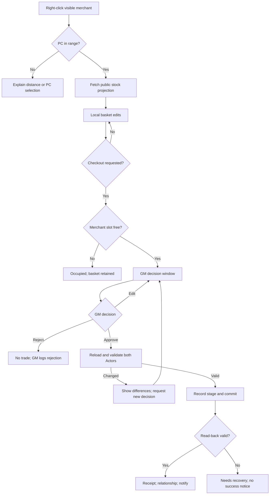
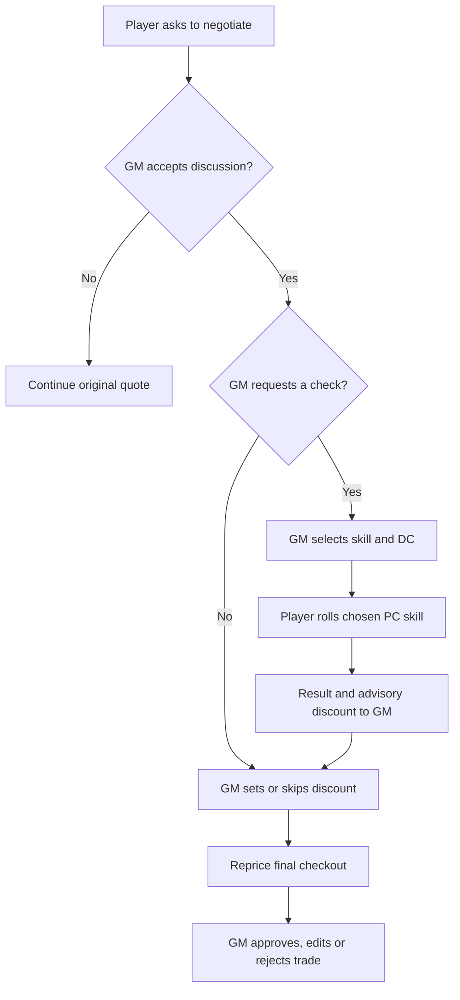
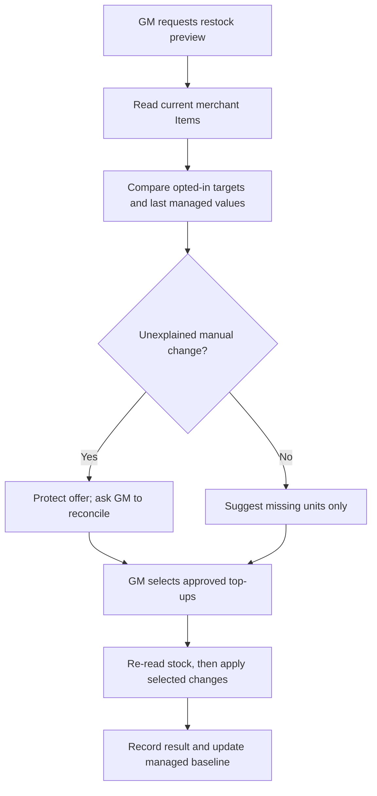

# Merchant workflows — Sprint 4 proposal

**Status:** state transitions for review, not current runtime behaviour. In these diagrams a
“write” occurs only on the GM's client after an explicit decision; merely viewing or proposing
never transfers stock or coins.

## Browse, basket and checkout

Entering the GM review occupies the one service slot for that merchant, not its stock. A second
customer may browse but cannot queue a simultaneous checkout to the same merchant. The first
approved **commit** has priority on limited stock. The basket retains the user's choices after
an occupied/stale result so the player can try again; it never contains live Actor references that
authorize a write by themselves.

## Negotiation inside an open checkout

Suggestions are computed from a documented policy and the GM's selected DC and result. Never
run an unrequested Persuasion check, silently change NPC attitude, or automatically apply the
suggestion. The GM may ignore the roll. A relationship's prior state affects only suggested
greeting and DC; it never edits the PC's roll. Negotiation counters update only after a completed
trade or an expressly confirmed GM encounter entry.

## Restock without overwriting GM changes

The existing RollTables provide an **initial assortment** or a suggestion when a GM explicitly
adds a new offer. They do not run on every restock. Sold-out Items should normally remain as
zero-quantity embedded offers so their price, origin and restock policy survive. Manual deletion
marks the offer suppressed; if a GM edits a quantity outside the module, it remains unchanged
until the GM chooses whether that edit represents depletion or a permanent adjustment.

## Authority, disconnects and recovery

1. One active GM client is the transaction coordinator. The GM's local queue serializes merchant
   and customer Actor writes; acquire multiple Actor locks in stable ID order. An occupied merchant
   rejects additional checkouts while still permitting read-only browse.
2. Recheck eligibility, relationship ban, range, Items, prices, source copies and currency
   immediately before committing. A proposed basket or quoted discount has no authority.
3. After approval, write a durable transaction record with the intended changes and a unique ID.
   Apply Actor Item and wallet updates in a documented order, checkpoint actual results, verify
   read-back, then mark the receipt completed. Reflect a replayed transaction ID without paying
   or transferring again.
4. A failure after any write becomes `needs-recovery`. Stop new checkouts affecting either Actor;
   compare source snapshots and actual embedded Items/currency and show the GM a reconciliation
   plan. Never “roll back” by blindly adding Items or coins after an uncertain write.
5. If the GM disconnects before approving, release the request without a write. If the GM
   disconnects during commit, leave that merchant/customer locked for explicit GM recovery after
   reconnect. A second GM must not independently replay the pending request.

Foundry document changes across two Actors and one ledger entry are not database-atomic. This
design gives an auditable, single-writer module workflow and recoverable failures; it does not
promise serializability against unrelated GM actions or third-party modules. The exact V14
multi-GM election and request authentication method are Sprint 5 feasibility gates. Without a
safe result, player-initiated checkout cannot be advertised as complete.
